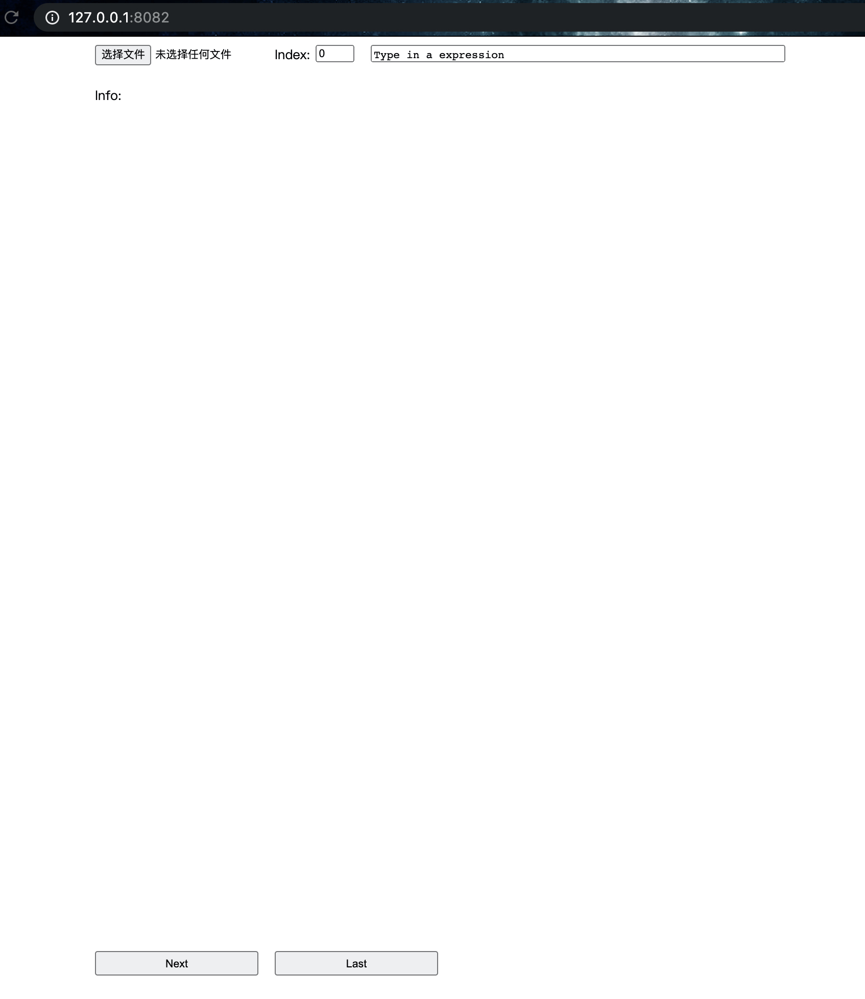

## Requirements

- remi
- pytorch
- pyecharts
- numpy
- pandas

## Usage

Save your attention weights as a torch `pt` file with the following contents:

```
list [
    dict {
        'src': list of tokens,
        'tgt': list of tokens,
        'weights': {
            'label0': weights,
            'label1': weights
        },
        'metrics': {
            'label0': metrics,
            'label1': metrics
        }
    }
]
```

`weights` can be either a torch matrix(2D) or list of triples(x, y, value)

`metrics` can be a single value or list of values

Here is an example:

```python
# save example data
import torch

data = [
    {
        'src': ['清华', '是', '一所', '大学'],
        'tgt': ['Tsinghua', 'is', 'a', 'university'],
        'weights': {
            'ref': [[0,0,1], [1,1,1], [2,2,1], [3,3,1]],
            'hyp': torch.Tensor([
                    [0.8, 0.0, 0.0, 0.2],
                    [0.0, 0.9, 0.1, 0.0],
                    [0.0, 0.2, 0.8, 0.0],
                    [0.0, 0.0, 0.1, 0.9]
                ]
            )
        },
        'metrics': {
            'hyp': (0.9,)
        }
    }
]

torch.save(data, 'sample.pt')
```

## UI

Start the server by

```shell
python main.py
```



use `选择文件` to select your `pt` file


Enjoy!

## Features

...